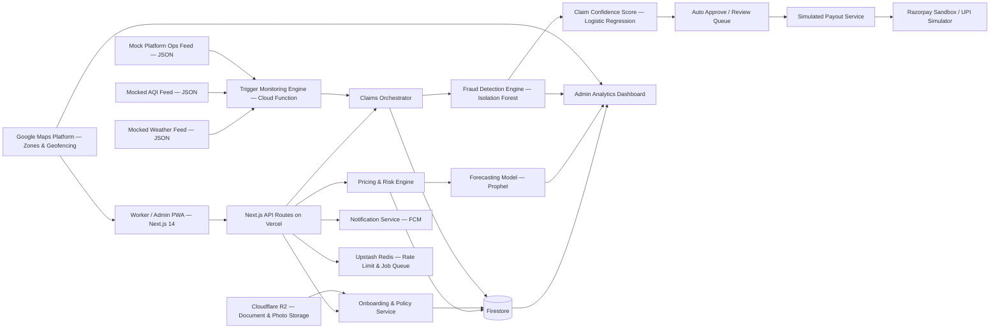

# RoziRakshak AI

### AI-powered parametric income protection for India's gig workforce

> **Tagline:** *If a rider cannot work because the city shuts them down, their income should not vanish too.*

---

## 1. The Idea in One Line

**RoziRakshak AI** is a **mobile-first, AI-enabled parametric insurance platform** that protects **delivery partners** from **loss of income** caused by **external disruptions** such as heavy rain, extreme heat, hazardous air quality, local zone shutdowns, and platform outages — with **weekly pricing**, **zero-touch claims**, and **instant simulated payouts**.

This solution is designed specifically for the DEVTrails 2026 challenge and strictly follows the golden rules:

* ✅ **Coverage is for loss of income only**
* ✅ **No health, life, accident, or vehicle repair coverage**
* ✅ **Pricing is weekly, not monthly**
* ✅ **Claims are triggered by objective external parameters**
* ✅ **AI is used for pricing, prediction, and fraud detection**

---

## 2. Why This Problem Matters

India's platform-based delivery workers are the invisible logistics engine behind food delivery, groceries, e-commerce fulfilment, and quick commerce. Yet their earnings are highly volatile.

When a rider cannot safely work because of:

* extreme heat,
* flooding or heavy rain,
* severe air pollution,
* curfew-like zone restrictions,
* or platform-side disruptions,

their income drops immediately.

For salaried workers, these shocks are absorbed by payroll systems. For gig workers, they become **personal financial emergencies**.

That makes this a perfect fit for **parametric insurance**:

* the event is externally measurable,
* the disruption is time-bound,
* the financial loss is real but repetitive,
* and payouts must be fast enough to matter.

RoziRakshak AI turns a rider's most unpredictable week into a **predictable, insurable risk**.

---

## 3. Chosen Persona

## Primary Persona: Quick-Commerce Delivery Partner

We focus on **grocery / quick-commerce delivery riders** working for platforms such as Zepto, Blinkit, Instamart, BigBasket Now, and similar services in dense urban zones.

### Why this persona?

This segment is highly relevant because:

1. **Their earnings are highly weekly in nature**

   * Incentives, bonuses, and working patterns are often tracked in short cycles.
2. **They are strongly exposed to weather and environmental stress**

   * Rain, heat, waterlogging, and pollution directly affect the feasibility of short-distance deliveries.
3. **They depend on micro-zones**

   * A disruption in even a few neighbourhood clusters can reduce the number of viable trips.
4. **The losses are measurable**

   * If a zone receives hazardous AQI, red-alert rainfall, or heat stress beyond threshold, order activity and safe ride hours drop sharply.
5. **They are mobile-first users**

   * This makes onboarding, policy management, and payout experience ideal for a smartphone-led solution.

---

## 4. Problem Statement Reframed as a Product Opportunity

The challenge is not just to sell insurance.

The challenge is to create a product that a rider will actually trust and use.

That means the solution must be:

* **simple to understand**,
* **cheap enough to buy weekly**,
* **automatic enough to remove claims friction**,
* **transparent enough to feel fair**,
* and **smart enough to prevent fraud without harassing honest workers**.

So we are not building a traditional insurance portal.

We are building a **livelihood protection engine**.

---

## 5. Product Vision

### Vision

To become the **default weekly safety net for gig workers** whenever external conditions make work unsafe or impossible.

### Mission

Protect riders from income shocks using:

* **parametric triggers** instead of manual paperwork,
* **AI-driven underwriting** instead of flat pricing,
* and **instant payout rails** instead of delayed settlements.

### North Star

> **"A worker should know by Monday how much protection they have for the week, and receive support within minutes of a verified disruption."**

---

## 6. What Makes RoziRakshak AI Special

## Core Differentiators

### 1. Weekly-first economics

Most insurance products think monthly or annually. Gig workers do not.

RoziRakshak uses a **weekly premium model**, aligned to:

* weekly earning cycles,
* weekly cash flow constraints,
* and weekly work volatility.

### 2. Parametric, not paperwork-heavy

Claims are not dependent on uploading damage proof or negotiating with an adjuster.

If a predefined disruption threshold is met, the system can:

* detect it,
* validate exposure,
* initiate claim flow,
* and simulate payout.

### 3. AI across the full lifecycle

AI is not added as a cosmetic feature. It is embedded into:

* onboarding risk profiling,
* premium personalization,
* disruption forecasting,
* fraud detection,
* payout confidence scoring,
* and portfolio analytics.

### 4. Built for trust

The rider sees:

* what is covered,
* what is not covered,
* why the premium changed,
* why a claim triggered or did not trigger,
* and how payout was computed.

### 5. Operationally scalable

Because it uses externally observable triggers, the platform can scale across cities without needing field inspections or manual claim review for every event.

---

## 7. Coverage Scope

## What we cover

We cover **income loss due to external disruptions** that prevent or significantly reduce the rider's ability to earn during the covered week.

### Indicative covered disruptions

| Disruption Type | Parametric Signal | Why it matters |
| --- | --- | --- |
| Heavy rain / flooding | Rainfall threshold + geofenced exposure + delivery zone risk | Deliveries halt, rider safety risk rises |
| Extreme heat | Heat index / WBGT threshold during active working window | Outdoor delivery becomes unsafe |
| Severe air pollution | AQI threshold sustained over time | Outdoor exposure becomes hazardous |
| Zone closure / curfew / access restriction | Verified geo-event + affected service area | Pickup/drop areas become inaccessible |
| Platform outage / abnormal order collapse | Platform signal or mocked ops feed | Worker loses income despite being available |

## What we do **not** cover

Strictly excluded:

* health insurance,
* medical claims,
* accident cover,
* vehicle damage or repair,
* theft,
* personal illness,
* non-work-related income loss,
* and any disruption not defined by the policy trigger rules.

This keeps the product compliant with the hackathon constraint and laser-focused on **loss of income only**.

---

## 8. Real User Scenario

### Persona Story: Arjun, a Bengaluru quick-commerce rider

* Arjun works 6 days a week.
* He typically earns between **₹700–₹1,100 per day**, depending on demand and incentives.
* He usually works in two micro-zones near dense apartment clusters.
* During monsoon weeks, waterlogging and rain alerts repeatedly shut down deliveries.

### What happens today?

* He loses 1–2 peak earning windows.
* Incentive targets become impossible to complete.
* Weekly take-home falls sharply.
* There is no protection even when the cause is external and city-wide.

### What happens with RoziRakshak AI?

1. Arjun buys a weekly plan in under 2 minutes.
2. The system prices his policy based on zone, shift patterns, and disruption forecast.
3. A severe rainfall event is detected in his geofenced working zone.
4. His historical activity and declared availability are validated.
5. The platform auto-initiates a parametric claim.
6. Fraud checks run in the background.
7. A simulated UPI payout is triggered instantly.

This is the shift from **"claim after suffering"** to **"support during disruption."**

---

## 9. Product Workflow

## End-to-End Flow

### A. Onboarding

The worker completes:

* mobile number verification,
* identity basics,
* city and service zone selection,
* platform type selection,
* typical working hours,
* average weekly earning range,
* UPI ID / payout preference,
* and consent for location-based verification.

### B. AI Risk Profiling

The system evaluates:

* city-level disruption frequency,
* zone-level environmental risk,
* shift exposure,
* historical volatility,
* rider activity consistency,
* and predicted weekly disruption probability.

### C. Weekly Policy Generation

The worker receives a simple weekly quote with:

* premium,
* covered triggers,
* maximum income protection amount,
* waiting rules if any,
* and payout calculation summary.

### D. Trigger Monitoring

The platform continuously monitors:

* weather events,
* AQI,
* heat stress,
* geofenced closures,
* and mocked platform availability/order feeds.

### E. Automatic Claim Initiation

When trigger thresholds are met, the claim engine:

* checks if the worker is covered that week,
* verifies exposure to the affected zone/time band,
* computes eligible loss bucket,
* and creates a claim with no manual form-filling.

### F. Fraud Decision Layer

The AI fraud service checks for:

* suspicious location behaviour,
* impossible movement,
* duplicate exposure attempts,
* emulator or spoof signatures,
* and abnormal repeat claim patterns.

### G. Payout

If the claim passes confidence thresholds:

* the payout is simulated to UPI / wallet / sandbox payment flow,
* the rider receives a plain-language explanation,
* and the dashboard is updated instantly.

---

## 10. Weekly Premium Model

This is the financial heart of the solution.

## Why weekly pricing wins

Gig workers think in short cash cycles:

* fuel today,
* food this week,
* incentives this weekend,
* rent at the month-end.

So the product must feel like:

* **affordable**,
* **predictable**,
* **renewable**,
* and **worth buying repeatedly**.

## Pricing philosophy

We propose a transparent weekly premium made of five components:

$$
\text{Weekly Premium} = \text{Base Cover} + \text{Zone Risk} + \text{Shift Exposure} + \text{Forecasted Disruption Load} - \text{Trust Discount}
$$

### Components

#### 1. Base Cover

Minimum amount for the selected weekly protection slab.

#### 2. Zone Risk

Higher in micro-zones with repeated flooding, unsafe AQI, or heat exposure.

#### 3. Shift Exposure

Higher for workers concentrated in vulnerable time windows such as afternoon heat peaks or late-evening storm windows.

#### 4. Forecasted Disruption Load

AI forecasts the probability of triggerable events in the upcoming 7 days.

#### 5. Trust Discount

Lower premium for riders with stable activity, verified patterns, no suspicious claims, and long retention.

## Example weekly plans

| Plan | Indicative Premium | Max Weekly Protection | Ideal For |
| --- | --- | --- | --- |
| Lite | ₹19–₹29 | ₹800 | Part-time riders |
| Core | ₹29–₹49 | ₹1,500 | Regular riders |
| Peak | ₹49–₹79 | ₹2,500 | High-dependence full-time riders |

> These are prototype ranges for the hackathon. Final pricing would be calibrated with real claims experience and insurer underwriting rules.

## Why this model is strong for judging

* It is easy to explain.
* It is realistic for gig-worker affordability.
* It shows AI value without becoming a black box.
* It is scalable city by city.

---

## 11. Parametric Trigger Design

The strongest parametric products win because triggers are objective, auditable, and fast.

We propose **5 automated triggers**.

## Trigger 1: Extreme Rainfall Trigger

**Signal:** Rainfall crosses threshold in rider's active geo-zone during covered working hours.

**Example logic:**

* hourly rainfall exceeds a critical value,
* or red-alert rainfall persists for a defined duration,
* and the worker is covered and assigned to that zone.

**Outcome:** Claim auto-created for rain-related income disruption slab.

## Trigger 2: Heat Stress Trigger

**Signal:** Heat index / wet-bulb-equivalent stress threshold crosses safe outdoor working limit.

**Why it matters:** Delivery riders are exposed directly to heat-risk hours, especially in afternoon windows.

**Outcome:** Compensation is mapped to affected time bands.

## Trigger 3: Hazardous AQI Trigger

**Signal:** AQI crosses hazardous threshold for sustained duration in worker's zone.

**Why it matters:** Outdoor activity becomes unsafe, and demand patterns may collapse.

## Trigger 4: Geo-Zone Restriction Trigger

**Signal:** Verified closure, access disruption, or emergency restriction in covered service area.

**Examples:** local shutdown, unrest-related closure, flood-blocked cluster, or platform service suspension in a locality.

## Trigger 5: Platform Disruption Trigger

**Signal:** Mocked or integrated platform operations feed shows severe outage / order collapse while the worker is verified as available.

**Why this is powerful:** It extends the concept beyond weather into real gig-platform dependency risk.

---

## 12. How Payouts Work

The payout system is designed to be instant, intuitive, and fair.

## Payout logic

Instead of asking "What exact rupee did you lose?", the system asks:

1. Did a valid external trigger happen?
2. Was the worker genuinely exposed to that trigger?
3. Which predefined income-loss slab applies?

### Example payout bands

| Trigger Severity | Verified Exposure | Indicative Payout |
| --- | --- | --- |
| Moderate | 2–3 hours affected | ₹150–₹250 |
| High | 4–6 hours affected | ₹300–₹500 |
| Severe | Multi-window / zone-wide disruption | ₹600–₹1,000 |

### Why slab-based payout works

* Faster than individualized calculation
* Easier for users to understand
* More robust against manipulation
* Well aligned to parametric product design

---

## 13. AI/ML Strategy

This is where the platform becomes more than a rules engine.
AI Module 1: Dynamic Premium Engine
Objective: Personalize weekly price while keeping fairness and transparency.
Input signals
city_tier, zone_id, week_of_year, season_flag, forecasted_disruption_probability, shift_start_hour, shift_duration_hours, declared_weekly_income_slab, claim_count_last_4_weeks, trust_score, days_since_registration, prior_zone_disruption_density
Model

Primary: XGBoost Regressor — gradient-boosted trees chosen for strong tabular performance, native feature importance for explaining premium changes to riders, and fast inference. Outperforms Random Forest on structured insurance data because it corrects errors iteratively rather than averaging independent trees.
Fallback: Deterministic rule engine — premium falls back to a hardcoded city_tier × zone_risk_band × shift_period multiplier table in JSON. No external call needed, returns in under 50ms.

Output

Personalized weekly premium (₹), risk tier (Low / Medium / High), top 2 plain-language reasons driving the price.

Build timeline

Week 1: Generate 500–1,000 synthetic rider records. Train baseline XGBoost. Validate RMSE on 20% held-out split. Serialize with Joblib. Expose via POST /premium/quote on FastAPI. Wire to Firestore policy creation flow.
Week 2: Add feature importance extraction. Implement JSON multiplier fallback. Unit test both paths.

AI Module 2: Disruption Forecasting Engine
Objective: Predict next-week disruption probability per city-zone every Sunday evening — feeds premium pricing and pre-alerts riders before high-risk weeks.
Model

Primary: Facebook Prophet — additive decomposition of trend, seasonality, and holiday effects. Handles Indian monsoon weekly cycles natively, registers Diwali and monsoon onset as named regressors in one line, and is robust to missing data. Chosen over LSTM (needs large data, overfits on months of mocked records) and ARIMA (manual p,d,q tuning, cannot handle multi-seasonality without becoming SARIMA). Runs as a scheduled weekly job, not on-demand.
Fallback: 4-week rolling average disruption frequency per zone from Firestore triggerEvents — used for zones with fewer than 8 weeks of history.

Use cases

Price ahead of the week, allocate risk pools, alert riders before high-risk windows, help admin anticipate payout volumes.

Build timeline

Week 1: Generate 6 months of mocked disruption data per zone with monsoon-pattern seeds. Train Prophet. Verify decomposition via model.plot_components().
Week 2: Schedule forecast as a Firebase Cloud Function every Sunday 8pm IST. Write results to forecasts Firestore collection. Confirm high-risk zones produce higher premiums.

AI Module 3: Fraud Detection Engine
Objective: Catch suspicious claims without penalizing genuine riders. (See Section 32 for full adversarial defense architecture.)
Model

Primary: Isolation Forest (contamination=0.05, n_estimators=100) — unsupervised anomaly detection on location, timing, device, and behavioural feature vectors. Normal points take many random splits to isolate; anomalies are isolated in very few. No labelled fraud data needed at launch. Tuned weekly based on false-positive rate in the admin review queue.
Secondary: Graph-based duplicate detection — builds a worker_id → device_fingerprint → upi_id linkage graph in Firestore. Flags any device fingerprint linked to more than 2 accounts or any UPI ID shared across more than 3 accounts. Catches coordinated rings that look individually normal to the forest.
Fallback: Hard-coded rule engine — speed > 80 km/h between pings → hold; emulator flag → hold; > 3 claims in rolling 7 days → hold. Fires unconditionally regardless of model availability.

Build timeline

Week 2: Build 20-feature vector extractor. Train on 500 synthetic records (90% normal, 10% injected anomalies). Serialize and expose via POST /fraud/score.
Week 3: Implement Firestore graph checker as a Cloud Function. Wire both into the claims orchestrator. End-to-end test: spoofed demo claim hits Track C with plain-language reason shown to worker.

AI Module 4: Claim Confidence Scoring
Each claim receives a confidence score (0–1) based on trigger authenticity, exposure match, behaviour consistency, historical trust, and device/location integrity.
Claims above 0.75 are auto-approved. Claims between 0.40–0.75 go to a soft review queue (admin resolves within 2 hours). Claims below 0.40 are held and the worker is notified with a plain-language reason — never silently denied.
Model

Primary: Logistic Regression on the 9-feature combined vector from Modules 1–3 — lightweight, produces well-calibrated probabilities (a score of 0.75 means genuinely 75% confident, not just a ranking), and its coefficients map directly to plain-language reasons shown to the worker.
Fallback: Weighted rule score using 5 binary checks (trigger confirmed / zone overlap / no emulator / speed plausible / no duplicate) — each check worth 0.2, scores summed.

Build timeline

Week 2: Train on synthetic labelled outcomes from the Module 3 dataset. Wire as final step in the claims orchestrator Cloud Function. Unit test that clean claim ≥ 0.75 and spoofed claim < 0.40.
Week 3: Surface score and top 2 contributing features in the admin fraud review UI.

AI Module 5: Portfolio Intelligence Dashboard
For insurers/admins, AI surfaces city-wise risk heat maps, predicted next-week claim volumes, fraud hotspots, loss ratios by trigger, and worker retention trends. This module consumes the outputs of Modules 1–4 already written to Firestore — no separate model, just real-time aggregation and visualization.
Build timeline

Week 3: Build admin Next.js dashboard. Wire Firestore real-time listeners. Render Leaflet heatmap from forecasts collection. Add Recharts for loss ratio and retention. Completable in 2–3 days once the upstream pipeline is running.
## 14. Fraud Prevention Philosophy

Hackathon judges often ask a critical question:

> "What stops riders from gaming the system?"

RoziRakshak answers this with **layered trust architecture**.

## Fraud controls

### Device trust

* emulator detection
* rooted-device risk flagging
* repeated device-account collisions

### Location trust

* GPS drift checks
* route consistency checks
* speed plausibility checks
* background location continuity

### Behaviour trust

* mismatch between declared working hours and actual activity pattern
* abnormal spike in claims frequency
* claims concentrated only in high-value events

### Identity trust

* KYC-lite matching
* payout account consistency
* duplicate worker profile detection

### Event trust

* trigger must be externally validated
* exposure must overlap with event geography and timing
* platform/order signals should support disruption narrative where applicable

This ensures the platform remains **worker-friendly but abuse-resistant**.

---

## 15. Why PWA Is the Right Choice

We use a **Progressive Web App (PWA)** served from a single Next.js codebase for both workers and admins.

## Why PWA over native

A PWA is the correct architectural choice for this product for three concrete reasons:

**1. Offline-first resilience for workers in bad weather**

The exact moments a rider needs the app — during a rainstorm, a power cut, a zone shutdown — are the moments connectivity is worst. Next.js with a service worker (via `next-pwa`) pre-caches the full UI shell, policy data, and active claim status to the device. A worker can open the app, see their coverage, and submit a claim even with zero signal. Sync fires when connectivity returns. This is not a nice-to-have; it is a core product requirement.

**2. Single codebase, two role experiences**

Both the rider-facing interface (mobile viewport, bottom navigation, UPI payout view) and the admin dashboard (wide viewport, data tables, fraud queues) are served from the same Next.js app with role-based routing. There is no separate React Native build, no separate APK to maintain, no app store review cycle. A URL is enough.

**3. Installable without the Play Store**

India's gig workers are on mid-range Android devices. A PWA install prompt requires no data, no Play Store account, and no storage overhead beyond the cached assets. It installs in seconds and behaves like a native app — home screen icon, full-screen mode, push notifications via Firebase Cloud Messaging.

## Worker experience (mobile viewport)

* one-handed usage,
* vernacular-ready text rendering,
* location permissions via browser API,
* push alerts for trigger events and payout status,
* UPI-linked payout visibility.

## Admin experience (desktop viewport)

* portfolio insights,
* trigger monitoring,
* fraud review queues,
* geographic analytics.

---

## 16. Proposed System Architecture

## Architecture principles

* event-driven claim initiation,
* modular AI services,
* auditability of trigger decisions,
* explainable premium changes,
* and fallback rule-based execution if ML is unavailable.

---

## Architecture Principles

| Principle | What it means in GigShield |
|----------|-----------------------------|
| Event-driven claim initiation | Claims are never manually "filed" by workers in the traditional sense — a trigger event (rain, AQI spike, heat index breach) detected by the monitoring engine automatically initiates the claim pipeline. The worker simply confirms or provides optional evidence. |
| Modular AI services | Each ML model (pricing, forecasting, fraud, confidence scoring) runs as an independent FastAPI microservice on Render. Any model can be retrained, swapped, or taken offline without affecting the rest of the system. |
| Auditability of trigger decisions | Every trigger event writes a complete audit document to Firestore (`triggerEvents` collection) — source feed, raw value, threshold applied, timestamp, affected zone, and resulting action. This trail is queryable from the admin dashboard and is essential for regulatory transparency. |
| Explainable premium changes | The pricing engine returns not just a premium amount but a breakdown of contributing factors (zone risk score, shift timing, claim history, seasonal adjustment) rendered to the worker as a simple visual explanation. XGBoost’s built-in feature importance powers this. |
| Fallback rule-based execution | If any ML microservice is unavailable (Render cold start timeout, model error), every AI module has a deterministic fallback (multiplier table, rolling average, hard-coded rules). The system degrades gracefully — no claim is ever blocked because a model is down. |

---

## 17. Tech Stack

The stack is chosen for precise fit to the product’s constraints: offline resilience for field workers, a single unified codebase, generous free tiers for all external services, and a Vercel-first deployment model.

---

### Frontend — PWA via Next.js

**Framework:** Next.js 14 (App Router) — serves both the worker mobile interface and the admin dashboard from one codebase. Role-based routing separates `/worker/` and `/admin/` views. The same build deploys to Vercel as a single project.

**PWA layer:** `@ducanh2912/next-pwa` (Serwist — the actively maintained fork of `next-pwa`, fully compatible with App Router) registers a service worker that pre-caches the full UI shell, active policy data, and the claim submission form. Workers can open the app, view live policy status, and queue a claim submission with zero connectivity. The service worker syncs the queued claim to Firestore the moment signal returns via the Background Sync API.

**Styling:** Tailwind CSS (utility-first, no runtime cost) + shadcn/ui component library (accessible, unstyled-by-default Radix primitives themed with Tailwind). shadcn/ui is chosen specifically because components are copied directly into the repo — no third-party bundle weight, no version drift.

**Push notifications:** Firebase Cloud Messaging (FCM) via the PWA’s service worker — handles trigger alerts ("Heavy rain detected in your zone — claim auto-initiated"), payout status updates, and weekly renewal reminders on Android and desktop without a native app.

---

### Backend — Firebase + Vercel API Routes

**Responsibility split:**

| Concern | Runs on | Why |
|--------|--------|-----|
| Client-facing API (auth-gated data fetching, presigned upload URLs, webhook ingress from Razorpay) | Vercel Serverless Functions (Next.js API routes) | Co-located with the frontend, sub-100ms cold starts, same deployment pipeline |
| Background event processing (Firestore-triggered claims orchestration, fraud pipeline, payout calls, trigger monitoring) | Firebase Cloud Functions (Node.js) | Firestore triggers are native to Firebase; no polling needed. Functions scale to zero. |

**Auth:** Firebase Authentication with phone/OTP sign-in. OTP is the only viable onboarding flow for gig workers who may not have a Google account. Firebase handles OTP delivery, session tokens, and the refresh cycle natively — no custom auth server required.

**Database:** Firestore (NoSQL, real-time). Collections map directly to the data model: `workers`, `policies`, `claims`, `triggerEvents`, `fraudSignals`, `payouts`. Firestore’s real-time listeners power the worker dashboard’s live claim status without polling. Offline persistence is enabled client-side so the worker app reads cached Firestore data when offline.

**File / photo storage:** Cloudflare R2 — chosen over Firebase Storage because R2’s free tier includes 10 GB storage and zero egress fees (Firebase Storage charges for downloads). Workers upload onboarding photos (ID, profile) and any optional claim evidence. A presigned URL is issued by a Next.js API route on Vercel; the PWA uploads directly from the browser to R2, keeping server functions out of the upload data path.

---

### Caching / Job Queues — Redis (Upstash)

Upstash Redis (serverless Redis, HTTP-based API) serves two purposes:

1. **Rate limiting** — the OTP endpoint and claim submission endpoint are rate-limited per phone number and IP to prevent abuse (sliding window algorithm via `@upstash/ratelimit`).
2. **Lightweight job queue** — the weekly premium recalculation batch enqueues worker IDs into a Redis list; a scheduled Cloud Function dequeues and recomputes premiums in batches.

Upstash’s free tier covers 10,000 commands/day — sufficient for the prototype. No Redis server to manage; Upstash is accessed over HTTPS from both Vercel API routes and Cloud Functions.

---

### AI / ML Models

All models run as Python microservices deployed on Render (free tier, spun up on demand) and called from Firebase Cloud Functions via HTTP.

| Module | Primary Model | Why | Fallback |
|--------|--------------|-----|----------|
| Premium Engine | XGBoost (scikit-learn pipeline) | Best accuracy on tabular rider + zone features; built-in feature importance for explainability | Deterministic multiplier table (city x zone x shift tier) |
| Disruption Forecasting | Facebook Prophet | Handles weekly seasonality and Indian monsoon cycles; trains on mocked historical JSON data. *Note: Prophet is in maintenance mode — NeuralProphet is the upgrade path for production.* | 4-week rolling average per city |
| Fraud Detection | Isolation Forest (sklearn) + graph-based duplicate check (Firestore query) | Unsupervised, no labelled fraud data needed at launch | Hard-coded rule engine: speed > 80 km/h, emulator flag, or > 3 claims / 7 days → auto-hold |
| Claim Confidence Score | Logistic Regression on combined feature vector | Lightweight, calibrated probability output, explainable coefficients | Weighted binary rule score (5 checks x 0.2 each) |

**AI microservice stack:** Python 3.11, scikit-learn, XGBoost, Prophet, pandas, NumPy, FastAPI (serving layer), Joblib (model serialization), Uvicorn (ASGI server).

---

### External Data Feeds (Mocked for Prototype)

All external data feeds are mocked for the prototype. Each mock is a static JSON file served from the Next.js `/public` directory and consumed by the Trigger Monitoring Engine (a scheduled Firebase Cloud Function). The mock schemas exactly mirror real API responses — swapping to a live feed requires only a URL and auth header change.

| Feed | Mock Approach | Real-World Equivalent (Production) |
|------|--------------|------------------------------------|
| Weather / rainfall | Static JSON: hourly rainfall (mm) per zone, updatable via test harness | Open-Meteo free API (no key, 10,000 calls/day) or IMD API |
| AQI / pollution | Static JSON: hourly AQI per zone | CPCB open data API or IQAir free tier |
| Heat stress | Derived from mocked weather JSON (temperature + humidity → NOAA heat index formula) | Same Open-Meteo feed, computed server-side |
| Platform ops disruption | Static JSON: order volume index per zone per hour | Mocked; real integration requires platform partnership (Zomato/Swiggy/Uber) |

---

### Maps & Geofencing — Google Maps Platform

Google Maps Platform is used for all map rendering and geospatial functionality:

- **Worker onboarding:** Zone selection via an interactive Google Map with pre-defined zone polygons overlay. Workers tap their operating zone; the selection is stored as a zone ID linked to a GeoJSON boundary in Firestore.
- **Admin dashboard:** Trigger event visualization (heatmaps of claims by zone), active policy density maps, and zone-level risk overlays.
- **Geofencing:** Zone boundary definitions are stored as GeoJSON in Firestore and cached in the PWA service worker. Client-side point-in-polygon checks use the Maps JavaScript API’s geometry library for real-time zone detection.

**Why Google Maps over alternatives:**

- Superior map detail and accuracy for Indian cities (critical for zone-level precision in Tier 2/3 cities).
- Google Maps Platform provides a $200/month free credit — more than sufficient for prototype-scale usage (~28,000 dynamic map loads/month free).
- Places API and Geocoding API enable address-to-zone resolution during onboarding.
- Familiar UX for gig workers who already use Google Maps daily.

**React integration:** `@vis.gl/react-google-maps` (Google’s official React wrapper for the Maps JavaScript API) — lightweight, hook-based, and actively maintained.

**Production hardening:** For production, geofence overlap validation and point-in-polygon checks move server-side to a Cloud Function using `@turf/turf` to prevent client-side manipulation. The Google Maps API key is restricted by HTTP referrer (frontend) and IP (backend) in the Google Cloud Console.

---

### Payments — Razorpay Test Mode

Razorpay in test mode simulates the full payout lifecycle. The Razorpay test environment supports the complete UPI payment flow (UPI ID entry → simulated bank confirmation → webhook callback) without real money movement.

- Test credentials are stored in Vercel environment variables (never committed to the repo).
- The payout simulation Cloud Function calls Razorpay’s `/payouts` API in test mode and records the response in Firestore.
- The webhook handler (a Vercel API route at `/api/webhooks/razorpay`) receives Razorpay’s test callback, verifies the signature, and updates the claim’s payout status in real time — the worker sees "Paid" on their dashboard within seconds.

No real banking integration or RBI compliance overhead for the prototype.

---

### Environment & Configuration

- **Vercel environment variables** store all secrets: Firebase service account key, Razorpay test keys, Upstash Redis URL/token, Cloudflare R2 access keys, Google Maps API key, and Render microservice URLs.
- **Firebase config** (client-side, non-secret) is embedded in the Next.js app via `NEXT_PUBLIC_` prefixed env vars.
- `.env.example` is committed to the repo with placeholder values and descriptions for every variable — any reviewer can set up the project without guessing.

---

### Deployment Summary — Vercel-First

| Layer | Host | Free Tier Coverage |
|------|------|-------------------|
| Next.js PWA + API routes | Vercel | 100 GB bandwidth, 100 hrs serverless |
| Firestore + Auth + FCM | Firebase (Google) | Spark plan: 1 GiB storage, 50K reads/day |
| Background trigger logic | Firebase Cloud Functions | 2M invocations/month |
| AI model microservices | Render | 750 hrs/month (spins down on idle) |
| Redis (rate limit + queue) | Upstash | 10K commands/day |
| File storage (photos, docs) | Cloudflare R2 | 10 GB storage, zero egress |
| Maps & geofencing | Google Maps Platform | $200/month free credit |
| Payment simulation | Razorpay Test Mode | Unlimited test transactions |

## 18. Data Model Snapshot

Key entities:

* `WorkerProfile`
* `Policy`
* `WeeklyCoverage`
* `RiskScore`
* `TriggerEvent`
* `Claim`
* `FraudSignal`
* `Payout`
* `Zone`
* `PlatformActivityFeed`

This structure supports both prototype simplicity and later scale.

---

## 19. Dashboard Design

## Worker dashboard

Shows:

* active weekly cover,
* premium paid,
* triggers watched this week,
* protected earnings,
* claim status,
* payout history,
* renewal reminder.

## Admin / insurer dashboard

Shows:

* active users by city,
* policy conversion funnel,
* risk distribution,
* claims by disruption type,
* fraud alerts,
* payout turnaround time,
* next-week risk forecast,
* loss ratio trends.

---

## 20. Business Viability

Hackathon-winning ideas are not just technically strong — they must also be commercially believable.

## Why this can work as a business

### 1. High-frequency, low-ticket product

Weekly protection fits rider cash behaviour and improves repeat engagement.

### 2. Parametric design reduces servicing cost

Less manual claims handling means better scalability.

### 3. Platform / insurer partnership opportunity

This product can be embedded into:

* gig platforms,
* neo-insurance apps,
* worker communities,
* or financial wellness marketplaces.

### 4. Data network effect

As the system observes more claims and disruptions, pricing, fraud control, and forecasting improve.

### 5. Expandable model

The same framework can later extend to:

* food delivery,
* e-commerce delivery,
* field service workers,
* and informal outdoor micro-entrepreneurs.

---

## 21. Social Impact

RoziRakshak AI creates value across three layers:

### For workers

* income stability
* dignity
* reduced emergency borrowing
* higher trust in formal financial protection

### For insurers / ecosystem players

* new low-ticket product category
* scalable underwriting opportunity
* richer operational insights

### For society

* stronger resilience for vulnerable workers
* better inclusion into formal protection systems
* practical climate adaptation through financial tools

---

## 22. Risks and Mitigations

| Risk | Why it matters | Mitigation |
| --- | --- | --- |
| False trigger events | Bad data leads to wrong payouts | Multi-source validation + confidence scoring |
| GPS spoofing | Fraudulent exposure claims | Full adversarial defense layer — see Section 32 |
| Worker distrust | Insurance may feel abstract | Plain-language rules + instant visibility + explainable pricing |
| Regulatory sensitivity | Insurance must be underwritten properly | Prototype framed for insurer-led or sandbox deployment |
| Data sparsity in early stage | ML quality may be weak initially | Rules + ML hybrid design |
| Affordability pressure | Riders are price-sensitive | Weekly slabs + loyalty discount + embedded distribution |

---

## 23. Execution Plan for the 6-Week Journey

This README is intentionally designed to align with the hackathon phases.

## Phase 1: Ideation & Foundation

### Deliverables

* final persona selection
* user journey mapping
* premium logic design
* parametric trigger design
* AI architecture blueprint
* UI wireframes
* README + 2-minute strategy video

## Phase 2: Automation & Protection

### Deliverables

* worker onboarding flow
* policy purchase flow
* pricing engine prototype
* trigger monitoring service
* automatic claim creation
* payout simulation

## Phase 3: Scale & Optimise

### Deliverables

* fraud detection module
* portfolio dashboard
* claim confidence scoring
* scenario simulator for judge demo
* final demo video and pitch deck

---

## 24. Demo Strategy

For the final demo, we will show a compelling narrative instead of only screens.

## Demo flow

1. Introduce Arjun, the rider.
2. Show weekly onboarding and policy purchase.
3. Show forecasted risk for the upcoming week.
4. Simulate a rainstorm / AQI spike / zone closure.
5. Trigger automatic claim creation.
6. Show fraud checks passing.
7. Trigger instant payout in sandbox.
8. Show updated worker dashboard.
9. Show admin analytics and next-week forecast.

This tells a full story: **problem → trigger → trust → payout → impact**.

---

## 25. Success Metrics

The prototype will be evaluated against measurable outcomes.

## Product KPIs

* onboarding completion rate
* quote-to-policy conversion rate
* weekly renewal rate
* payout turnaround time
* claim automation rate
* fraud detection precision
* false-positive review rate
* protected earnings per worker

## Impact KPIs

* income volatility reduced
* average time to support after disruption
* repeat usage / retention
* worker trust score / NPS

---

## 26. Why This Project Can Win

RoziRakshak AI is not just a technically compliant answer. It is a **judge-friendly, user-centric, and business-credible** solution.

### It can win because it is:

* **highly relevant** to India's gig economy,
* **fully aligned** with the problem constraints,
* **clear in scope**,
* **strong on AI depth**,
* **strong on fraud prevention**,
* **easy to demo live**,
* **practical to build in stages**,
* and **emotionally compelling** because it protects livelihoods, not just assets.

This is the kind of product that feels meaningful, believable, and scalable.

---

## 27. Future Extensions

Beyond the hackathon, the platform can evolve into:

* multilingual voice onboarding,
* WhatsApp-based policy renewal,
* embedded platform partnerships,
* city risk heat maps for worker planning,
* family emergency micro-benefit bundles,
* and insurer-grade actuarial calibration.

---

## 28. Suggested Pitch Closing

> **India's gig economy runs on weekly effort. Its protection systems should too.**
>
> RoziRakshak AI transforms unpredictable disruptions into measurable events, measurable events into trusted claims, and trusted claims into fast financial relief.
>
> We are not insuring bikes. We are not insuring devices. We are protecting livelihoods.

---

## 29. Research-Informed Foundations Behind This Concept

This concept is grounded in broadly accepted realities from the gig-work and insurance ecosystem:

* gig workers face limited formal social protection,
* income volatility is one of their biggest risks,
* climate and city-level disruptions increasingly affect outdoor work,
* parametric products are most effective when triggers are objective and payouts are fast,
* and trust is the biggest adoption barrier in low-ticket insurance.

Our design directly responds to those realities through:

* weekly affordability,
* mobile-first simplicity,
* explainable AI,
* automatic claims,
* and strong anti-fraud controls.

---

## 30. Final Statement

RoziRakshak AI is a modern insurance idea for a modern workforce.

It respects the hackathon rules, solves a real pain point, demonstrates meaningful AI, and offers a clean path from prototype to real-world adoption.

If gig workers keep cities moving, then cities owe them a smarter safety net.

---

## 31. Repository Intent

This repository will be used to progressively build:

* the worker mobile experience,
* the admin dashboard,
* the pricing and claims engine,
* the fraud intelligence layer,
* and the final demo-ready prototype.

---
## 32. Adversarial Defense & Anti-Spoofing Strategy (GPS Spoofing Rings)

**Context:** A coordinated syndicate of ~500 delivery workers in a tier-1 city exploited a parametric insurance platform using GPS-spoofing apps. Operating from home via Telegram-coordinated groups, they faked their presence in red-alert weather zones and drained the liquidity pool with mass false payouts.

**RoziRakshak is designed so this attack cannot succeed** because a GPS coordinate is treated as a *claim*, not a proof.

---

### The Core Problem With GPS-Only Verification

A spoofing app can emit any coordinate at any time with no obvious anomaly. Any system that trusts GPS coordinates as the sole proof of presence in a trigger zone will be exploited.

**Our architecture treats GPS as one signal among many — and the weakest one.**  
We require *corroboration* across device behaviour, network conditions, and historical consistency.

---

## 1) Differentiation: Genuine Stranded Worker vs. Bad Actor

The fundamental difference between a genuinely stranded worker and a GPS spoofer is **corroborating signal density**.

- A real rider in a real storm produces a consistent, multi-layered footprint.
- A spoofer produces “perfect GPS in isolation” (and often at home).

We evaluate every claim against **five independent signal layers** simultaneously.

---

## Layer 1 — Lightweight Sensor Fusion (works on budget Android)

We intentionally rely on signals that typically exist even on **₹5k–₹15k** Android devices.

**In-browser / PWA signals (prototype-ready):**
- **Motion variance (accelerometer over 30s window):**  
  Home devices tend to be near-stationary; a field rider shows micro-movement (handling phone, walking, bike vibration).
- **Network type (Wi‑Fi vs cellular) + RTT/downlink:**  
  Home Wi‑Fi is usually stable; storm-hit zones often show degraded cellular and higher RTT.
- **GPS accuracy radius (meters):**  
  Real GPS during storms is noisy (accuracy fluctuates). Spoofers often emit suspiciously clean accuracy patterns.

> Note: availability depends on device/browser. If a sensor/API is missing, we **don’t fail the worker** — the system simply down-weights that feature.

**Production hardening (native wrapper, no full app rewrite):**
- Wrap the existing Next.js PWA using **Capacitor.js** to add:
  - Mock-location detection (`isFromMockProvider`, dev settings)
  - Emulator detection heuristics
  - More reliable sensor access where supported (e.g., motion, battery stats)

This is a **low-effort migration path** (PWA stays the product; native shell only strengthens verification).

### Device Compatibility (Minimum Requirements)

RoziRakshak relies on a **minimum baseline** of device signals to keep payouts fraud-resistant.  
If a device cannot provide these baseline signals reliably, we mark it as **Not Supported** (instead of making a low-confidence decision that could unfairly delay or deny a genuine worker).

**Minimum required capabilities (baseline):**
- GPS / Geolocation with accuracy metadata
- Motion sensing (accelerometer / DeviceMotion)
- Cellular connectivity indicators (4G/5G/Cellular vs Wi‑Fi) and basic network stats where available

**When we detect an unsupported device:**
- The user is shown a clear message:  
  *“Your device is not supported for parametric claim verification because required sensors/network signals are unavailable.”*
- The worker is prompted to continue only after switching to a supported device (or completing re-verification on a supported device).

This prevents both fraud (no-signal devices are easy to spoof) and unfair outcomes (we don’t punish workers for missing telemetry).
---

## Layer 2 — GPS Signal Quality Metadata (not just coordinates)

Real GPS in storms becomes “messy”: accuracy fluctuates, drift appears, intermittent gaps happen.

Spoofing apps often look *too perfect*:
- constant accuracy
- constant pings at identical intervals
- minimal drift over long time windows

We log **raw GPS metadata** (e.g., accuracy, timestamp gaps, jitter) and score **statistical plausibility** using an anomaly detector (e.g., Isolation Forest / robust z-score rules).

**Example heuristics (tunable per city):**
- Accuracy standard deviation stays unrealistically low across N pings → suspicious
- Identical coordinate repeats with no jitter for long durations → suspicious

---

## Layer 3 — Historical Mobility Pattern Consistency (hard to fake at scale)

Each worker builds a baseline over ~2–4 weeks:
- typical overnight cluster (“home area”)
- usual corridors/routes
- typical speeds and dwell times
- normal zone entry/exit patterns

During a claim, we ask:
- Did the user arrive via a plausible path?
- Are there intermediate pings?
- Is speed between pings physically realistic?

**Example checks:**
- “Teleportation”: >120 km/h between pings or large distance jumps with no route continuity → flagged
- Sudden appearance 8 km away with no travel trace → flagged

A spoofer at home fails this quickly. A real rider naturally passes.

---

## Layer 4 — Cross-Worker Zone Density Anomaly (defeats Telegram-coordinated rings)

Every zone has a learned “normal” density from historical platform activity.

When a trigger event fires, we compute:
- **simultaneous claim density ratio** = current claimants in zone / expected normal active riders

If a zone suddenly has 10× the normal rider population, that’s physically implausible.

**Action:** hold/verify *that window’s cluster*, not the entire system.  
A genuine single rider is typically unaffected; a 500-person ring spoofing the same zone/time is caught.

---

## Layer 5 — Network-Side Corroboration (production-grade)

We treat network corroboration as a supporting layer, not a single point of failure.

Depending on deployment constraints, this can include:
- **IP geolocation vs claimed zone** (weak but useful)
- **latency/ASN consistency** (proxy/VPN patterns)
- **native-level network signals** via Capacitor/Android APIs where feasible

> Important: browser PWAs typically do **not** expose cell tower IDs directly.  
> In production, deeper tower-level checks would require OS-level access or carrier/aggregator integrations.

---

# 2) What We Analyze Beyond Basic GPS (Feature Vector)

No single feature is decisive. The **Claim Confidence Scorer** evaluates all signals jointly.

### Device-level (PWA / low-end friendly)
| Feature | Availability | Why it matters |
|---|---:|---|
| Motion variance (30s window) | ✅ Often available | Stationary home device vs field activity |
| Network type (Wi‑Fi / cellular) | ✅ Often available | Home Wi‑Fi vs field cellular |
| RTT / downlink (when available) | ✅ Partial support | Degrades in congested storm zones |
| GPS accuracy radius (m) | ✅ | Spoofers often look “too clean” |

### Production hardening (native wrapper, optional)
| Feature | Availability | Why it matters |
|---|---:|---|
| Mock location flag | ⚠️ Native | Directly catches common spoof setups |
| Emulator flag | ⚠️ Native | Blocks emulator farms |
| Battery usage patterns (coarse) | ⚠️ Native | Idle-at-home vs active-in-field pattern |

### Behavioral / historical (server-side from Firestore)
| Feature | Why it matters |
|---|---|
| Distance from established home cluster | Spoofer stays home; real rider travels |
| Route continuity score | Did pings trace a plausible path? |
| Speed between last pings | Teleportation = spoof |
| Claim frequency (rolling 7 days) | Sudden spikes indicate abuse |
| Days since registration | New accounts claiming instantly = synthetic |
| Payout account change recency | UPI changed right before claim = risk |

### Cross-worker ring detection
| Feature | Why it matters |
|---|---|
| Simultaneous claim density ratio | Mass spoofing in same zone/window |
| Shared device fingerprint / shared payout IDs | Detects fraud rings and consolidation |
| Claim timestamp clustering | 500 claims within 3 minutes = coordination/botting |

### 3. The UX Balance: Handling Flagged Claims Without Penalizing Honest Workers

This layer protects trust — the core currency of **RoziRakshak AI**.

A false positive can break that trust just as much as a missed payout. That’s why our design clearly separates **suspicion** from **denial**.

A flagged claim is **never silently rejected**. Instead, it moves through one of three resolution tracks, guided by the **Claim Confidence Score** generated by our AI model.

---

### Track A — Auto-Approved (Confidence ≥ 0.75)

When multiple sensor and network signals strongly confirm a rider’s presence in the affected zone, the claim is approved instantly.

- No action is required from the user.
- Typical conditions such as GPS drops or temporary connectivity loss are treated as expected behaviour during genuine weather events — not as anomalies.
- Payments are triggered immediately in this track.

---

### Track B — Soft Flag / Clarification Requested (Confidence 0.40 – 0.75)

When confidence is moderate, the claim is temporarily held — **not because it is suspicious**, but because the system expects more data to arrive.

This up to **2-hour window** is intentional, not arbitrary. In real-world conditions (rain, network congestion, low battery), data often arrives late or in fragments.

During this time, the system automatically:

- Collects delayed GPS pings that sync once connectivity improves
- Pulls cell tower handoff data to validate movement patterns
- Reconciles sensor logs (accelerometer, motion) that upload after buffering
- Checks for network transitions (e.g., mobile data ↔ weak signal zones)

At the same time, the rider is kept informed. They receive a simple notification:

> “We’re verifying your claim — this usually takes under 2 hours. You don’t need to do anything right now.”

This removes anxiety — the worker knows their claim is in progress, not rejected.

- If the confidence score improves (≥ 0.75), the claim is automatically approved and moved to **Track A**.
- If it remains borderline, an admin gets a pre-structured summary of key signals (location match, signal drift, network type) and can approve with a single tap.
- The worker is never asked to re-submit or manually prove anything.

---

### Track C — Hold for Investigation (Confidence < 0.40)

When the available data strongly contradicts the claim — for example, if the device appears stationary on a home Wi-Fi network far from the event zone — the system moves the claim into investigation.

The worker is immediately notified in clear, respectful language:

> “We couldn’t verify your location during this window. Our records show your device was connected to Wi-Fi at your registered home area.”

Instead of blocking them, the system provides a one-tap appeal option where the worker can:

- Add context (e.g., “network outage”, “phone switched”)
- Optionally upload a photo or supporting proof

All appeals are reviewed and resolved within **24 hours**.

If low-confidence patterns repeat, the system triggers a lightweight KYC re-check — never a silent ban or automatic penalty.

---

## Fairness by Design

- **Transparency:** Every flag includes a clear reason code (“GPS–network mismatch”, “duplicate UPI”, etc.).
- **Tolerant to real-world noise:** Weak signals, GPS drops, and erratic sensor readings are treated as normal during extreme conditions — often strengthening authenticity rather than weakening it.
- **Human-verified fallback:** No payout is ever denied purely by automation — only deferred.
- **Trust-safe defaults:** When evidence suggests probability but not certainty, the claim is escalated for priority human review — never auto-approved nor silently dropped.

---

This balanced structure ensures genuine workers get fast payouts, while still protecting the system from coordinated fraud. Instead of turning uncertainty into frustration, it turns it into a transparent and reassuring experience — making the hardest part of fraud defense the strongest trust feature of the product.
