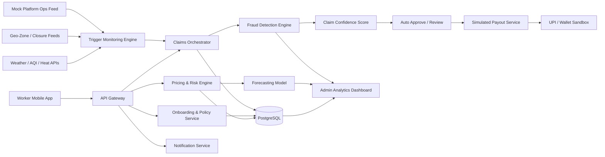

# RoziRakshak AI

### AI-powered parametric income protection for India’s gig workforce

> **Tagline:** _If a rider cannot work because the city shuts them down, their income should not vanish too._

---

## 1. The Idea in One Line

**RoziRakshak AI** is a **mobile-first, AI-enabled parametric insurance platform** that protects **delivery partners** from **loss of income** caused by **external disruptions** such as heavy rain, extreme heat, hazardous air quality, local zone shutdowns, and platform outages — with **weekly pricing**, **zero-touch claims**, and **instant simulated payouts**.

This solution is designed specifically for the DEVTrails 2026 challenge and strictly follows the golden rules:

- ✅ **Coverage is for loss of income only**
- ✅ **No health, life, accident, or vehicle repair coverage**
- ✅ **Pricing is weekly, not monthly**
- ✅ **Claims are triggered by objective external parameters**
- ✅ **AI is used for pricing, prediction, and fraud detection**

---

## 2. Why This Problem Matters

India’s platform-based delivery workers are the invisible logistics engine behind food delivery, groceries, e-commerce fulfilment, and quick commerce. Yet their earnings are highly volatile.

When a rider cannot safely work because of:

- extreme heat,
- flooding or heavy rain,
- severe air pollution,
- curfew-like zone restrictions,
- or platform-side disruptions,

their income drops immediately.

For salaried workers, these shocks are absorbed by payroll systems. For gig workers, they become **personal financial emergencies**.

That makes this a perfect fit for **parametric insurance**:

- the event is externally measurable,
- the disruption is time-bound,
- the financial loss is real but repetitive,
- and payouts must be fast enough to matter.

RoziRakshak AI turns a rider’s most unpredictable week into a **predictable, insurable risk**.

---

## 3. Chosen Persona

## Primary Persona: Quick-Commerce Delivery Partner

We focus on **grocery / quick-commerce delivery riders** working for platforms such as Zepto, Blinkit, Instamart, BigBasket Now, and similar services in dense urban zones.

### Why this persona?

This segment is highly relevant because:

1. **Their earnings are highly weekly in nature**
	- Incentives, bonuses, and working patterns are often tracked in short cycles.

2. **They are strongly exposed to weather and environmental stress**
	- Rain, heat, waterlogging, and pollution directly affect the feasibility of short-distance deliveries.

3. **They depend on micro-zones**
	- A disruption in even a few neighbourhood clusters can reduce the number of viable trips.

4. **The losses are measurable**
	- If a zone receives hazardous AQI, red-alert rainfall, or heat stress beyond threshold, order activity and safe ride hours drop sharply.

5. **They are mobile-first users**
	- This makes onboarding, policy management, and payout experience ideal for a smartphone-led solution.

---

## 4. Problem Statement Reframed as a Product Opportunity

The challenge is not just to sell insurance.

The challenge is to create a product that a rider will actually trust and use.

That means the solution must be:

- **simple to understand**,
- **cheap enough to buy weekly**,
- **automatic enough to remove claims friction**,
- **transparent enough to feel fair**,
- and **smart enough to prevent fraud without harassing honest workers**.

So we are not building a traditional insurance portal.

We are building a **livelihood protection engine**.

---

## 5. Product Vision

### Vision

To become the **default weekly safety net for gig workers** whenever external conditions make work unsafe or impossible.

### Mission

Protect riders from income shocks using:

- **parametric triggers** instead of manual paperwork,
- **AI-driven underwriting** instead of flat pricing,
- and **instant payout rails** instead of delayed settlements.

### North Star

> **“A worker should know by Monday how much protection they have for the week, and receive support within minutes of a verified disruption.”**

---

## 6. What Makes RoziRakshak AI Special

## Core Differentiators

### 1. Weekly-first economics
Most insurance products think monthly or annually. Gig workers do not.

RoziRakshak uses a **weekly premium model**, aligned to:

- weekly earning cycles,
- weekly cash flow constraints,
- and weekly work volatility.

### 2. Parametric, not paperwork-heavy
Claims are not dependent on uploading damage proof or negotiating with an adjuster.

If a predefined disruption threshold is met, the system can:

- detect it,
- validate exposure,
- initiate claim flow,
- and simulate payout.

### 3. AI across the full lifecycle
AI is not added as a cosmetic feature. It is embedded into:

- onboarding risk profiling,
- premium personalization,
- disruption forecasting,
- fraud detection,
- payout confidence scoring,
- and portfolio analytics.

### 4. Built for trust
The rider sees:

- what is covered,
- what is not covered,
- why the premium changed,
- why a claim triggered or did not trigger,
- and how payout was computed.

### 5. Operationally scalable
Because it uses externally observable triggers, the platform can scale across cities without needing field inspections or manual claim review for every event.

---

## 7. Coverage Scope

## What we cover

We cover **income loss due to external disruptions** that prevent or significantly reduce the rider’s ability to earn during the covered week.

### Indicative covered disruptions

| Disruption Type | Parametric Signal | Why it matters |
|---|---|---|
| Heavy rain / flooding | Rainfall threshold + geofenced exposure + delivery zone risk | Deliveries halt, rider safety risk rises |
| Extreme heat | Heat index / WBGT threshold during active working window | Outdoor delivery becomes unsafe |
| Severe air pollution | AQI threshold sustained over time | Outdoor exposure becomes hazardous |
| Zone closure / curfew / access restriction | Verified geo-event + affected service area | Pickup/drop areas become inaccessible |
| Platform outage / abnormal order collapse | Platform signal or mocked ops feed | Worker loses income despite being available |

## What we do **not** cover

Strictly excluded:

- health insurance,
- medical claims,
- accident cover,
- vehicle damage or repair,
- theft,
- personal illness,
- non-work-related income loss,
- and any disruption not defined by the policy trigger rules.

This keeps the product compliant with the hackathon constraint and laser-focused on **loss of income only**.

---

## 8. Real User Scenario

### Persona Story: Arjun, a Bengaluru quick-commerce rider

- Arjun works 6 days a week.
- He typically earns between **₹700–₹1,100 per day**, depending on demand and incentives.
- He usually works in two micro-zones near dense apartment clusters.
- During monsoon weeks, waterlogging and rain alerts repeatedly shut down deliveries.

### What happens today?

- He loses 1–2 peak earning windows.
- Incentive targets become impossible to complete.
- Weekly take-home falls sharply.
- There is no protection even when the cause is external and city-wide.

### What happens with RoziRakshak AI?

1. Arjun buys a weekly plan in under 2 minutes.
2. The system prices his policy based on zone, shift patterns, and disruption forecast.
3. A severe rainfall event is detected in his geofenced working zone.
4. His historical activity and declared availability are validated.
5. The platform auto-initiates a parametric claim.
6. Fraud checks run in the background.
7. A simulated UPI payout is triggered instantly.

This is the shift from **“claim after suffering”** to **“support during disruption.”**

---

## 9. Product Workflow

## End-to-End Flow

### A. Onboarding

The worker completes:

- mobile number verification,
- identity basics,
- city and service zone selection,
- platform type selection,
- typical working hours,
- average weekly earning range,
- UPI ID / payout preference,
- and consent for location-based verification.

### B. AI Risk Profiling

The system evaluates:

- city-level disruption frequency,
- zone-level environmental risk,
- shift exposure,
- historical volatility,
- rider activity consistency,
- and predicted weekly disruption probability.

### C. Weekly Policy Generation

The worker receives a simple weekly quote with:

- premium,
- covered triggers,
- maximum income protection amount,
- waiting rules if any,
- and payout calculation summary.

### D. Trigger Monitoring

The platform continuously monitors:

- weather events,
- AQI,
- heat stress,
- geofenced closures,
- and mocked platform availability/order feeds.

### E. Automatic Claim Initiation

When trigger thresholds are met, the claim engine:

- checks if the worker is covered that week,
- verifies exposure to the affected zone/time band,
- computes eligible loss bucket,
- and creates a claim with no manual form-filling.

### F. Fraud Decision Layer

The AI fraud service checks for:

- suspicious location behaviour,
- impossible movement,
- duplicate exposure attempts,
- emulator or spoof signatures,
- and abnormal repeat claim patterns.

### G. Payout

If the claim passes confidence thresholds:

- the payout is simulated to UPI / wallet / sandbox payment flow,
- the rider receives a plain-language explanation,
- and the dashboard is updated instantly.

---

## 10. Weekly Premium Model

This is the financial heart of the solution.

## Why weekly pricing wins

Gig workers think in short cash cycles:

- fuel today,
- food this week,
- incentives this weekend,
- rent at the month-end.

So the product must feel like:

- **affordable**,
- **predictable**,
- **renewable**,
- and **worth buying repeatedly**.

## Pricing philosophy

We propose a transparent weekly premium made of five components:

$$
	ext{Weekly Premium} = \text{Base Cover} + \text{Zone Risk} + \text{Shift Exposure} + \text{Forecasted Disruption Load} - \text{Trust Discount}
$$

### Components

#### 1. Base Cover
Minimum amount for the selected weekly protection slab.

#### 2. Zone Risk
Higher in micro-zones with repeated flooding, unsafe AQI, or heat exposure.

#### 3. Shift Exposure
Higher for workers concentrated in vulnerable time windows such as afternoon heat peaks or late-evening storm windows.

#### 4. Forecasted Disruption Load
AI forecasts the probability of triggerable events in the upcoming 7 days.

#### 5. Trust Discount
Lower premium for riders with stable activity, verified patterns, no suspicious claims, and long retention.

## Example weekly plans

| Plan | Indicative Premium | Max Weekly Protection | Ideal For |
|---|---:|---:|---|
| Lite | ₹19–₹29 | ₹800 | Part-time riders |
| Core | ₹29–₹49 | ₹1,500 | Regular riders |
| Peak | ₹49–₹79 | ₹2,500 | High-dependence full-time riders |

> These are prototype ranges for the hackathon. Final pricing would be calibrated with real claims experience and insurer underwriting rules.

## Why this model is strong for judging

- It is easy to explain.
- It is realistic for gig-worker affordability.
- It shows AI value without becoming a black box.
- It is scalable city by city.

---

## 11. Parametric Trigger Design

The strongest parametric products win because triggers are objective, auditable, and fast.

We propose **5 automated triggers**.

## Trigger 1: Extreme Rainfall Trigger

**Signal:** Rainfall crosses threshold in rider’s active geo-zone during covered working hours.

**Example logic:**

- hourly rainfall exceeds a critical value,
- or red-alert rainfall persists for a defined duration,
- and the worker is covered and assigned to that zone.

**Outcome:** Claim auto-created for rain-related income disruption slab.

## Trigger 2: Heat Stress Trigger

**Signal:** Heat index / wet-bulb-equivalent stress threshold crosses safe outdoor working limit.

**Why it matters:** Delivery riders are exposed directly to heat-risk hours, especially in afternoon windows.

**Outcome:** Compensation is mapped to affected time bands.

## Trigger 3: Hazardous AQI Trigger

**Signal:** AQI crosses hazardous threshold for sustained duration in worker’s zone.

**Why it matters:** Outdoor activity becomes unsafe, and demand patterns may collapse.

## Trigger 4: Geo-Zone Restriction Trigger

**Signal:** Verified closure, access disruption, or emergency restriction in covered service area.

**Examples:** local shutdown, unrest-related closure, flood-blocked cluster, or platform service suspension in a locality.

## Trigger 5: Platform Disruption Trigger

**Signal:** Mocked or integrated platform operations feed shows severe outage / order collapse while the worker is verified as available.

**Why this is powerful:** It extends the concept beyond weather into real gig-platform dependency risk.

---

## 12. How Payouts Work

The payout system is designed to be instant, intuitive, and fair.

## Payout logic

Instead of asking “What exact rupee did you lose?”, the system asks:

1. Did a valid external trigger happen?
2. Was the worker genuinely exposed to that trigger?
3. Which predefined income-loss slab applies?

### Example payout bands

| Trigger Severity | Verified Exposure | Indicative Payout |
|---|---|---:|
| Moderate | 2–3 hours affected | ₹150–₹250 |
| High | 4–6 hours affected | ₹300–₹500 |
| Severe | Multi-window / zone-wide disruption | ₹600–₹1,000 |

### Why slab-based payout works

- Faster than individualized calculation
- Easier for users to understand
- More robust against manipulation
- Well aligned to parametric product design

---

## 13. AI/ML Strategy

This is where the platform becomes more than a rules engine.

## AI Module 1: Dynamic Premium Engine

**Objective:** Personalize weekly price while keeping fairness and transparency.

### Input signals

- city,
- zone,
- season,
- forecasted weather severity,
- typical working window,
- weekly income slab,
- prior disruption density,
- claim history,
- trust score.

### Model options

- Gradient Boosting / XGBoost / LightGBM for tabular pricing features
- fallback rule engine for explainability and fail-safe execution

### Output

- personalized weekly premium,
- risk tier,
- explanation highlights.

## AI Module 2: Disruption Forecasting Engine

**Objective:** Predict next-week disruption load and expected claims pressure.

### Use cases

- price ahead of the week,
- allocate risk pools,
- alert riders before high-risk windows,
- help admin anticipate payout volumes.

## AI Module 3: Fraud Detection Engine

**Objective:** Catch suspicious claims without penalizing genuine riders.

### Fraud patterns to detect

- GPS spoofing,
- emulator-based fake location,
- impossible travel speed,
- repeated claims across overlapping zones,
- duplicate account behaviour,
- low-activity worker suddenly claiming every event,
- inconsistent platform availability signals.

### Model options

- Isolation Forest for anomaly detection
- Graph-based linkage analysis for duplicate or collusive patterns
- Rules + ML hybrid for production-grade explainability

## AI Module 4: Claim Confidence Scoring

Each claim receives a confidence score based on:

- trigger authenticity,
- exposure match,
- behaviour consistency,
- historical trust,
- and device/location integrity.

Claims above threshold are auto-approved. Borderline claims are routed for review.

## AI Module 5: Portfolio Intelligence Dashboard

For insurers/admins, AI surfaces:

- city-wise risk heat maps,
- predicted next-week claim volumes,
- fraud hotspots,
- loss ratios by trigger,
- and worker retention trends.

---

## 14. Fraud Prevention Philosophy

Hackathon judges often ask a critical question:

> “What stops riders from gaming the system?”

RoziRakshak answers this with **layered trust architecture**.

## Fraud controls

### Device trust
- emulator detection
- rooted-device risk flagging
- repeated device-account collisions

### Location trust
- GPS drift checks
- route consistency checks
- speed plausibility checks
- background location continuity

### Behaviour trust
- mismatch between declared working hours and actual activity pattern
- abnormal spike in claims frequency
- claims concentrated only in high-value events

### Identity trust
- KYC-lite matching
- payout account consistency
- duplicate worker profile detection

### Event trust
- trigger must be externally validated
- exposure must overlap with event geography and timing
- platform/order signals should support disruption narrative where applicable

This ensures the platform remains **worker-friendly but abuse-resistant**.

---

## 15. Why Mobile-First Is the Right Choice

We choose **mobile-first** for workers and **web dashboard** for admins.

## Worker side: mobile app

Because riders need:

- one-handed usage,
- low-friction onboarding,
- vernacular communication,
- location permissions,
- push alerts,
- and UPI-linked payout visibility.

## Admin side: web dashboard

Because operations teams need:

- portfolio insights,
- trigger monitoring,
- fraud queues,
- and geographic analytics.

## Final UX decision

- **Worker app:** mobile-first
- **Admin portal:** responsive web

This split gives the best user experience for both sides.

---

## 16. Proposed System Architecture

## Architecture principles

- event-driven claim initiation,
- modular AI services,
- auditability of trigger decisions,
- explainable premium changes,
- and fallback rule-based execution if ML is unavailable.

---

## 17. Tech Stack

The stack is designed for **fast hackathon delivery** and **credible production evolution**.

## Frontend

- **Worker app:** React Native / Expo
- **Admin portal:** Next.js
- **UI:** Tailwind / NativeWind + component library

## Backend

- **API layer:** FastAPI
- **Auth:** OTP-based authentication + JWT sessions
- **Database:** PostgreSQL
- **Caching / job queues:** Redis

## AI / ML

- Python
- scikit-learn
- XGBoost / LightGBM
- pandas / NumPy
- rules engine for explainability

## Data / Integrations

- Weather APIs (free tier or mocked)
- AQI / pollution feed (free tier or mocked)
- Maps / geofencing API
- mocked platform operations feed
- Razorpay test mode / UPI simulator / sandbox payment rail

## Deployment

- Vercel / Netlify for dashboard
- Render / Railway / Azure App Service for API
- Supabase / Neon / managed PostgreSQL for fast setup

---

## 18. Data Model Snapshot

Key entities:

- `WorkerProfile`
- `Policy`
- `WeeklyCoverage`
- `RiskScore`
- `TriggerEvent`
- `Claim`
- `FraudSignal`
- `Payout`
- `Zone`
- `PlatformActivityFeed`

This structure supports both prototype simplicity and later scale.

---

## 19. Dashboard Design

## Worker dashboard

Shows:

- active weekly cover,
- premium paid,
- triggers watched this week,
- protected earnings,
- claim status,
- payout history,
- renewal reminder.

## Admin / insurer dashboard

Shows:

- active users by city,
- policy conversion funnel,
- risk distribution,
- claims by disruption type,
- fraud alerts,
- payout turnaround time,
- next-week risk forecast,
- loss ratio trends.

---

## 20. Business Viability

Hackathon-winning ideas are not just technically strong — they must also be commercially believable.

## Why this can work as a business

### 1. High-frequency, low-ticket product
Weekly protection fits rider cash behaviour and improves repeat engagement.

### 2. Parametric design reduces servicing cost
Less manual claims handling means better scalability.

### 3. Platform / insurer partnership opportunity
This product can be embedded into:

- gig platforms,
- neo-insurance apps,
- worker communities,
- or financial wellness marketplaces.

### 4. Data network effect
As the system observes more claims and disruptions, pricing, fraud control, and forecasting improve.

### 5. Expandable model
The same framework can later extend to:

- food delivery,
- e-commerce delivery,
- field service workers,
- and informal outdoor micro-entrepreneurs.

---

## 21. Social Impact

RoziRakshak AI creates value across three layers:

### For workers
- income stability
- dignity
- reduced emergency borrowing
- higher trust in formal financial protection

### For insurers / ecosystem players
- new low-ticket product category
- scalable underwriting opportunity
- richer operational insights

### For society
- stronger resilience for vulnerable workers
- better inclusion into formal protection systems
- practical climate adaptation through financial tools

---

## 22. Risks and Mitigations

| Risk | Why it matters | Mitigation |
|---|---|---|
| False trigger events | Bad data leads to wrong payouts | Multi-source validation + confidence scoring |
| GPS spoofing | Fraudulent exposure claims | Device trust + location anomaly detection |
| Worker distrust | Insurance may feel abstract | Plain-language rules + instant visibility + explainable pricing |
| Regulatory sensitivity | Insurance must be underwritten properly | Prototype framed for insurer-led or sandbox deployment |
| Data sparsity in early stage | ML quality may be weak initially | Rules + ML hybrid design |
| Affordability pressure | Riders are price-sensitive | Weekly slabs + loyalty discount + embedded distribution |

---

## 23. Execution Plan for the 6-Week Journey

This README is intentionally designed to align with the hackathon phases.

## Phase 1: Ideation & Foundation

### Deliverables
- final persona selection
- user journey mapping
- premium logic design
- parametric trigger design
- AI architecture blueprint
- UI wireframes
- README + 2-minute strategy video

## Phase 2: Automation & Protection

### Deliverables
- worker onboarding flow
- policy purchase flow
- pricing engine prototype
- trigger monitoring service
- automatic claim creation
- payout simulation

## Phase 3: Scale & Optimise

### Deliverables
- fraud detection module
- portfolio dashboard
- claim confidence scoring
- scenario simulator for judge demo
- final demo video and pitch deck

---

## 24. Demo Strategy

For the final demo, we will show a compelling narrative instead of only screens.

## Demo flow

1. Introduce Arjun, the rider.
2. Show weekly onboarding and policy purchase.
3. Show forecasted risk for the upcoming week.
4. Simulate a rainstorm / AQI spike / zone closure.
5. Trigger automatic claim creation.
6. Show fraud checks passing.
7. Trigger instant payout in sandbox.
8. Show updated worker dashboard.
9. Show admin analytics and next-week forecast.

This tells a full story: **problem → trigger → trust → payout → impact**.

---

## 25. Success Metrics

The prototype will be evaluated against measurable outcomes.

## Product KPIs

- onboarding completion rate
- quote-to-policy conversion rate
- weekly renewal rate
- payout turnaround time
- claim automation rate
- fraud detection precision
- false-positive review rate
- protected earnings per worker

## Impact KPIs

- income volatility reduced
- average time to support after disruption
- repeat usage / retention
- worker trust score / NPS

---

## 26. Why This Project Can Win

RoziRakshak AI is not just a technically compliant answer. It is a **judge-friendly, user-centric, and business-credible** solution.

### It can win because it is:

- **highly relevant** to India’s gig economy,
- **fully aligned** with the problem constraints,
- **clear in scope**,
- **strong on AI depth**,
- **strong on fraud prevention**,
- **easy to demo live**,
- **practical to build in stages**,
- and **emotionally compelling** because it protects livelihoods, not just assets.

This is the kind of product that feels meaningful, believable, and scalable.

---

## 27. Future Extensions

Beyond the hackathon, the platform can evolve into:

- multilingual voice onboarding,
- WhatsApp-based policy renewal,
- embedded platform partnerships,
- city risk heat maps for worker planning,
- family emergency micro-benefit bundles,
- and insurer-grade actuarial calibration.

---

## 28. Suggested Pitch Closing

> **India’s gig economy runs on weekly effort. Its protection systems should too.**
>
> RoziRakshak AI transforms unpredictable disruptions into measurable events, measurable events into trusted claims, and trusted claims into fast financial relief.
>
> We are not insuring bikes. We are not insuring devices. We are protecting livelihoods.

---

## 29. Research-Informed Foundations Behind This Concept

This concept is grounded in broadly accepted realities from the gig-work and insurance ecosystem:

- gig workers face limited formal social protection,
- income volatility is one of their biggest risks,
- climate and city-level disruptions increasingly affect outdoor work,
- parametric products are most effective when triggers are objective and payouts are fast,
- and trust is the biggest adoption barrier in low-ticket insurance.

Our design directly responds to those realities through:

- weekly affordability,
- mobile-first simplicity,
- explainable AI,
- automatic claims,
- and strong anti-fraud controls.

---

## 30. Final Statement

RoziRakshak AI is a modern insurance idea for a modern workforce.

It respects the hackathon rules, solves a real pain point, demonstrates meaningful AI, and offers a clean path from prototype to real-world adoption.

If gig workers keep cities moving, then cities owe them a smarter safety net.

---

## 31. Repository Intent

This repository will be used to progressively build:

- the worker mobile experience,
- the admin dashboard,
- the pricing and claims engine,
- the fraud intelligence layer,
- and the final demo-ready prototype.

---

## 32. Team Note

If needed for submission, replace the project name, screenshots, video links, team details, and deployment links in later phases while keeping this README as the strategic backbone of the solution.

